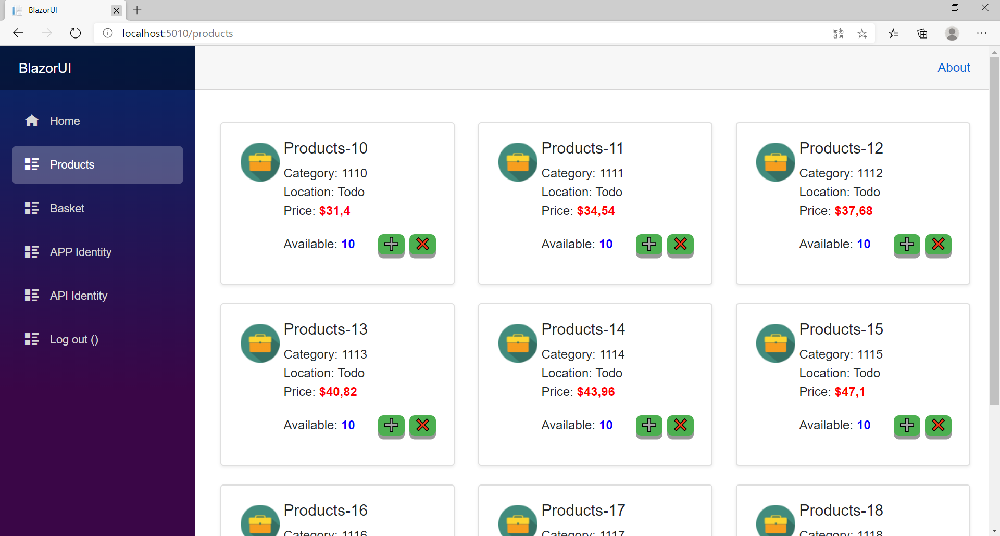
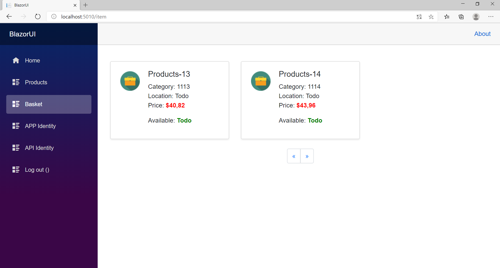
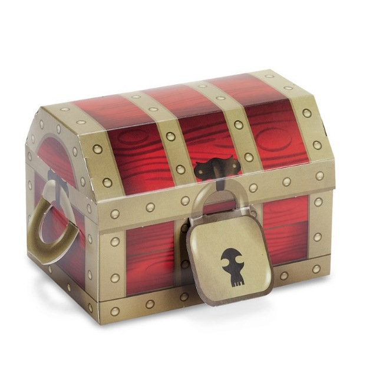
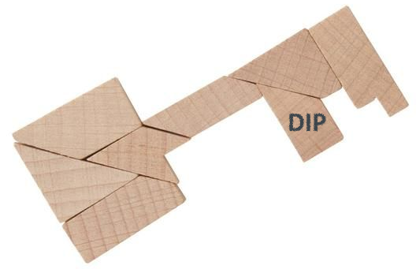
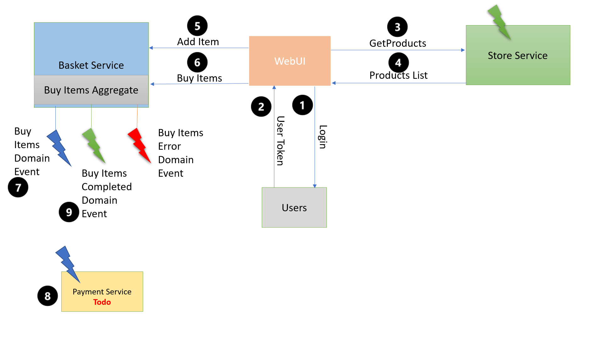
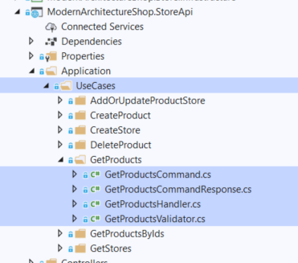
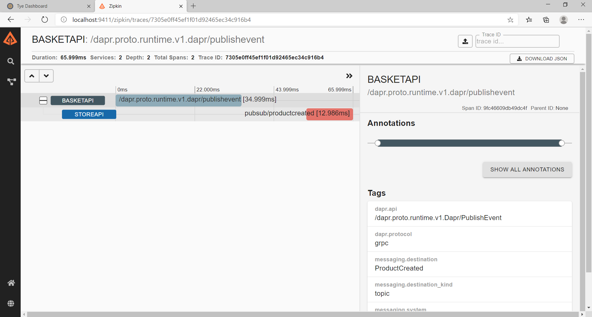

ModernArchitectureShop
======================

Modern Architecture Shop is a clean-lightweight.NET microservices
application, showcasing the use of [Dapr](https://dapr.io/) to build
microservices-based applications. It is a simple online shop with all
the core components that make up such a system, for example, a frontend
for users authentication, product catalog, and basket and payment
processing, etc.

[Dapr](https://dapr.io/) is an event-driven, portable runtime for
building microservices on edge and cloud. This project intended to show
how you can make a clean microservices application with Dapr. The
project design decisions, balancing between realism and a
simple demo showcase, but in the context of a real working application,
you have to take some other design decisions which fit better to your
functional and non-functional requirements.

The backend microservices are written in C\# (however, it\'s worth
noting that Dapr is language independent), and the frontend is a Blazor.
All APIs are REST & HTTP & gRPC based.

**Tech Stacks**

        

Demo
----







## [Getting Started](https://github.com/alugili/ModernArchitectureShop/blob/master/docs/Getting_Started.md) 


This project is related to a series of C\#Corner articles: 
----------------------------------------------------------

-   Modern Architecture Shop (Clean Architecture and Microservices), Part I (Done)
    This article is about the current application architecture and what we can do to make the project architecture clean.

-   Modern Architecture Shop (Clean Architecture in the Microservices, DDD), Part II (Future)
    This article shows you how to separate the infrastructure from the application. In other words, make the infrastructure dependent on the application.

-   Modern Architecture Shop Fixing the tech problems (Future-article)
    Logging/Debugging/Testing is essential to create a successful: Zipkin, Serilog, Seq in our shop.
    And extending the services, Payment Services, and more UI.

-   Modern Architecture Shop Dapr Pure (Future)
    In this article, we will use Dapr in-depth.

The final goal of this project is to make a clean microservices
application that can be deployed to the Kubernetes platform and run on
Dapr runtime with and without Tye options.

The first showcase is using Dapr in a very simple way (No: State Management, Actors, etc.).

Obviously, this means we have to do everything by ourselves, for
example, if you add a product to the basket, then you have to send a
domain event which can be procced in the store service and make the
product as reserved.

Also, you have to send the data as an aggregate(Transaction), and if any
error is occurring during the data processing, then you have to roll
back the data.

Finally, I will implement the same services with Dapr(State Management,
Actors, Communication, etc.). After that, you can compare the two
solutions, and I will show you how Dapr can simplify the problems and
making the development process more comfortable.

### Store Service

This service represents the Store. The current implementation is very
minimal

With this service, you can add/remove/update products to/from/in any
store or add/remove a new store.

API routes:

```cs
/api/products GET All products
```

The service contains all products. Each registered user can add/remove
items to/from his shopping cart(Basket Service). Admin users can add
/remove products (still in progress) to/from the stores.

Store - Dapr Interaction

Pub/Sub. Subscribes to the store-queue topic to receive new notification
from the basket service.
State. Stores: next version
Actor: next version
Bindings: next version

### Basket service

provides a basket service to the Store.

API routes:

```cs
/api/item/{itemJson} Post a new item and store it in the user basket
/api/item/{Id} Delete the item with the given Id from the basket
/api/items Get all items from the basket for the logged-in user
```

The service is responsible for maintaining the users\' shopping carts
and persisting them. Submitting a cart will validate the cart contents
and turn it into an order item, which is sent to the Payment service for
further processing.

Cart - Dapr Interaction

Pub/Sub: The basket service pushes shopping carts entities to the
store-queue topic and to the payment topic to complete the order.
State. Stores: next version
Actor: next version
Bindings: next version
Service Invocation: next version

### Users Management Service

provides a simple user management service to the Modern Store. Only
registered users can use the Shop to place orders etc.

The service generates the bearer token.

Users - Dapr Interaction

State: todo

### BlazorUI-Frontend

This is the application user interface offering direct user interaction
with the system and is responsible for managing the shop. It is
programmed in Blazor, and all data is fetched via a REST API endpoint.

### Frontend host

Blazor Server.

Clean Architecture
------------------

Clean Architecture is the key to Loosely-Coupled-Application. It allows
you completely to decouple the application from the infrastructure.





**Clean Architecture Separates**

-   User Interface
-   Database
-   Use Cases
-   Domain


Clean Architecture core concept from Uncle bob book

### Benefits

-   Independent of Database
-   Independent of Frameworks
-   Effective testable
-   Independent of any external agency
-   All business logic is in use cases

### Clean architecture can solve below-listed problems

-   Decisions are taken too early
-   It's hard to change,
-   It's centered around frameworks
-   It's centered around the database
-   We focus on technical aspects 
-   It's hard to find things
-   Business logic is spread everywhere
-   Heavy tests

ModernArchitectureShop architecture
-----------------------------------


Architecture Overview


Design Flow Overview
Each domain service divided into four parts:


.Domain
It contains only the POCOs and the related domain events.

.Application
It contains the Uses Cases, Interfaces for the infrastructure, and other
business logic stuff.

.Infrastructure
It contains Infrastructure stuff like databases etc.

.Api
The WebAPI stuff.

Note!
StoreApi and the BasketApi assemblies are mixing the Infrastructure and
the WebAPI and the Application Logic. In the next version, I will
separate them according to the clean architecture principles.

### ModernArchitectureShop.BlazorUI Service

In the ModernArchitectureShop.BlazorUI.Startup.cs I have registered all
services, and I have added the HTTP clients to the services.

#### HTTP Clients

IdentityService.cs
Is responsible for the login/logout

ProductService.cs
Retrieves all products from the Store and display them the
Products.razor

BasketProductService.cs
It manages the basket, for example, adding or removing items to/from the
basket.

### ModernArchitectureShop.StoreApi Service

The WebApi for the Store.

#### Controllers

ProductsController.cs loads the products from the store service and
forward them to the BlazorUI as follows:

```cs
public async Task<IActionResult> GetProducts([FromQuery]
GetProductsCommand command)
{
  var result = await _mediator.Send(command);
  return Ok(result);
}
```

The MediatR design pattern is used to reduce the dependencies between
objects. 

As shown below, the GetProductsHanlder called from the mediator.



```cs
public async Task<GetProductsCommandResponse>
Handle(GetProductsCommand command, CancellationToken cancellationToken)
{
  var query = _dbContext.Set<Product>();

  var totalOfProducts = await query.CountAsync(cancellationToken);
  var products = await query.AsNoTracking()
    .OrderBy(x =\> x.Code)
    .Skip((command.PageIndex - 1) \* command.PageSize)
    .Take(command.PageSize)
    .Include(x =\> x.ProductStores)
    .ThenInclude(x =\> x.Store)
    .ProjectTo\<ProductDto\>(\_mapper.ConfigurationProvider)
    .ToListAsync(cancellationToken);

   var result = new GetProductsCommandResponse
   {
    Products = products,
    TotalOfProducts = totalOfProducts
   };

  return result;
}
```

The data is displayed in the products.razor as follows:

```cs
protected override async Task OnParametersSetAsync()
{
  var response = await ProductService.GetProductsAsync(ProcessUrl());

  if (response.StatusCode == (int) System.Net.HttpStatusCode.OK)
  {
    _productsModel =JsonConvert.DeserializeObject<ProductsModel>(response.Content);
  }
  else
  {
    _errorMessage = $"Error: {response.Error}";
    _productsModel = new ProductsModel();
  }
}
```

The response above contains the products and the count. Finally, the
products are displayed, as shown below.

```cs
<div class="row mt-4">

@foreach (var product in _productsModel.Products)

{ .....
```

### ModernArchitectureShop.BasketApi

It contains tow controllers: ItemController.cs and ItemsController.cs

ItemController creates and deletes items to/from the basket.

ItemsController retrieves items from the database.

Again, I have used here MediatR:

```cs
\\Application\\UsesCases\\AddItemHandler

public async Task<ItemDto> Handle(AddItemCommand command, CancellationToken cancellationToken)
{
  var itemFromCommand = _mapper.Map<Item>(command);
  var items = _dbContext.Set<Item>();

  var itemFromDb = await items.SingleOrDefaultAsync(x => x.ItemId ==  command.ItemId, cancellationToken: cancellationToken);

  if (itemFromDb != null)
  {
    _mapper.Map(itemFromCommand, itemFromDb);
    items.Update(itemFromDb);
  }
  else
  {
    await _dbContext.Items.AddAsync(itemFromCommand, cancellationToken);
  }

  await _dbContext.SaveChangesAsync(cancellationToken);
  await _itemCreatedNotificationHandler.Handle(new ItemCreatedMessage(), cancellationToken);

  return \_mapper.Map\<ItemDto\>(itemFromCommand);
}
```

Once the items are added to the database, the ItemCreatedMessage.cs
(Dapr) message is being published to the Store. We need this message,
for example, to update the reserved items.

```cs
\\Application\\UsesCases\\GetItemsHandler

public async Task<GetItemsCommandResponse> Handle(GetItemsCommand command, CancellationToken cancellationToken)
{
  var query = \_dbContext.Set\<Item\>();

  var totalOfItems = await query.Where(i => i.Username == command.Username).CountAsync(cancellationToken);
  var items = await query.AsNoTracking()
    .OrderBy(x => x.Code)
    .Skip((command.PageIndex - 1) \* command.PageSize)
    .Take(command.PageSize)
    .ProjectTo<ItemDto>(_mapper.ConfigurationProvider)
    .Where(i => i.Username == command.Username)
    .ToListAsync(cancellationToken);

  var result = new GetItemsCommandResponse
  {
    Items = items,
    TotalOfItems = totalOfItems,
  };

 return result;
}
```

The above items are loaded and return it to the BlazorUI so that it can
display them.

Summary
-------

ModernArchitectureShop is a modern light microservices application. We
have seen that the current implementation is not ideal, and it needs
some cleanups. In the next article, I will decouple the application from
the infrastructure, and I will extend the project.

Tye Dashboard


Zipkin


